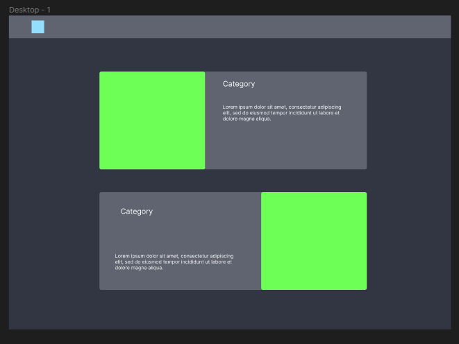
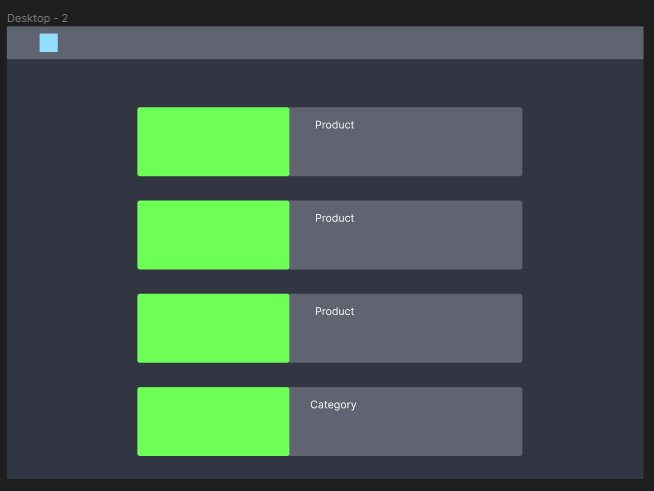
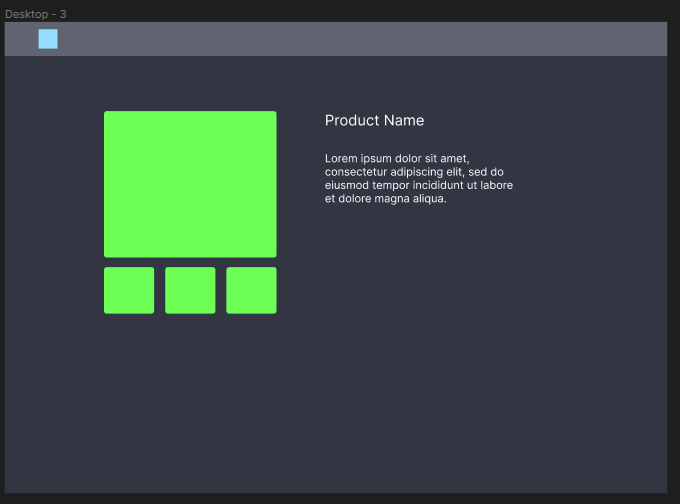
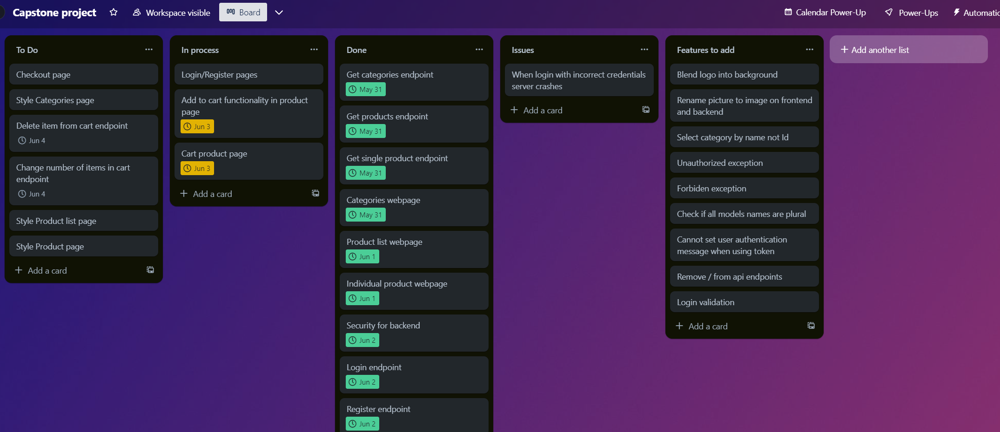

# Zinware Angular App

- [Zinware Angular App](#zinware-angular-app)
  - [Overview](#overview)
  - [Tools and Technologies](#tools-and-technologies)
  - [Approach](#approach)
    - [User stories](#user-stories)
    - [Visualizing](#visualizing)
    - [Result](#result)
  - [Planing documentation](#planing-documentation)
  - [Resources and References](#resources-and-references)
  - [Shoutouts](#shoutouts)

## Overview

This project involves building a Front-end angular app for an e-commerce website selling computer peripherals. Users can register, browse products like mice, keyboards, and headphones, and add items to their cart.

You can find backend for this project [here](https://github.com/maklaut007/zinware-backend).

## Tools and Technologies

- JavaScript
- IDE - Visual Studio Code
- Framework - Angular 16
- Styling - SCSS
- Testing -

## Approach

### User stories

First thing before creating a website I wrote user stories of how user should interact with pages. I split my work into interations between which I did my backend for the next one.

Iteration One - Public pages:

- As a user, I should be able to see a list of categories to pick a type I device I want to buy.
- As a user, I should be able to open a category to see a list of devices of similar type.
- As a user, I should be able to open individual device page so I can order that specific device.

Iteration Two - Authorization:

- As a user, I should be able to register account to buy products.
- As a user, I should be able to login to my account to buy products.

Iteration Three - Cart interaction:

- As a user, I should be able to add product to cart in any quantity I want.
- As a user, I should be able open my cart to see what products I'm planning to buy.
- As a user, I should be able to remove product from cart if I'm don't want to order it.
- As a user, I should be able to change quantity of specific product to oreder in my cart.

Iteration Four - Chekcout:

- As a user, I should be able to checkout products in my cart so they will be delivered to me.

### Visualizing

After creating user stories I created basic website scetches as starting point for my design as well as choosing colors for my design. As a design tool I used [Figma](https://www.figma.com).

 

Colors for my page were:

-  `#073357` - first background color
-  `#000a18` - second background color
-  `#69c7f3` - first text color
-  `#f5f9fa` - second text color

### Result

I created 7 total pages with their own functionality and purpose

- Categories page
- Category products page
- Product page
- Registation page
- Login page
- Cart page
- Checkout page

## Planing documentation

As a planning documentation for this and [backend project](https://github.com/maklaut007/zinware-backend) I used Trello board:

## Resources and References

https://www.w3schools.com

- [Official Angular website](https://angular.io) - Angular info
- [W3Schools](https://www.w3schools.com) - CSS styling
- [Stack Overflow](https://stackoverflow.com) - troubleshooting
- [Trello](https://trello.com) - planning board
- [Figma](https://www.figma.com) - design scetches
- [Midjorney AI](https://www.midjourney.com/home) - image generation
- [Font Awesome](https://fontawesome.com) - icons
- [BEM](https://getbem.com) - classes naming methodology

## Shoutouts
